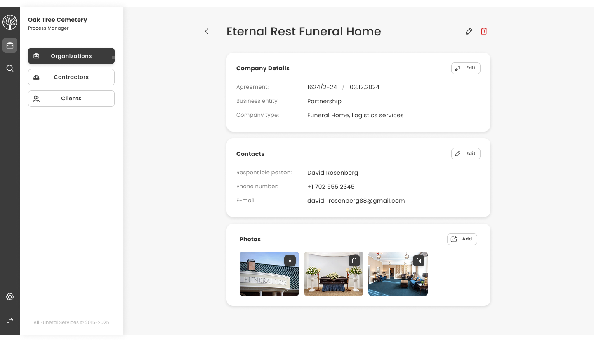

## Tестовое задание в компанию All Funeral



Deploy: https://test-allfuneral-chi.vercel.app/organizations/12

### Архитектура

Для проекта выбрана модульная архитектура bulletproof-react.

https://github.com/alan2207/bulletproof-react ⭐️ 32000 звезд

### Кроме того что в задании, что сделано еще:

1. Error Boundary
2. Сделан роутинг по страницам
3. Добавлены страницы:

- search
- settings
- organization list

4. Настроены eslint, prettier, husky

5. Добавлена favicon

### О вакансии

Вакансия: https://hh.ru/vacancy/124331882?from=share_android

Компания: https://tending.app

Тестовое: https://test-task-api.allfuneral.com

Фигма тестового: https://www.figma.com/design/IGQeCdz8lHMRz5m5xteLCr/AFS---Test-Assignment

### Старт

```bash
git clone git@github.com:evakerrigan/test_Allfuneral.git
```

```bash
cd test_Allfuneral
```

```bash
npm install
```

```bash
npm run dev
```
